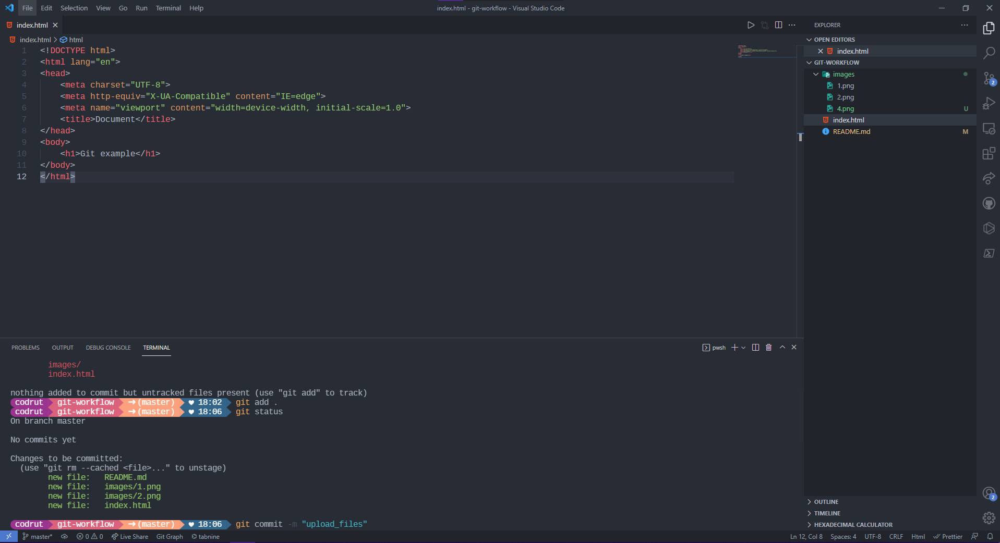
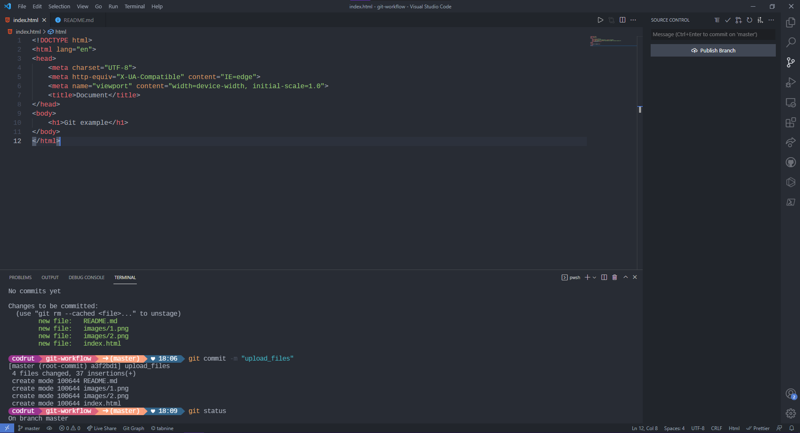
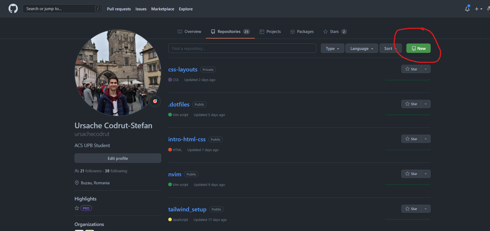
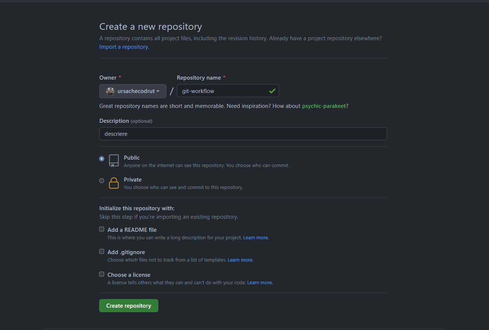
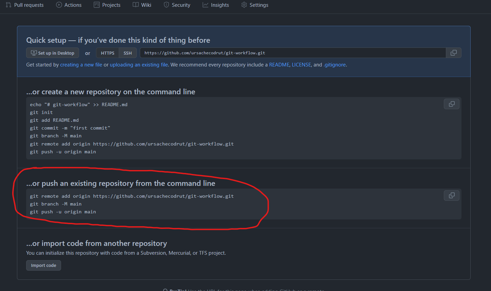
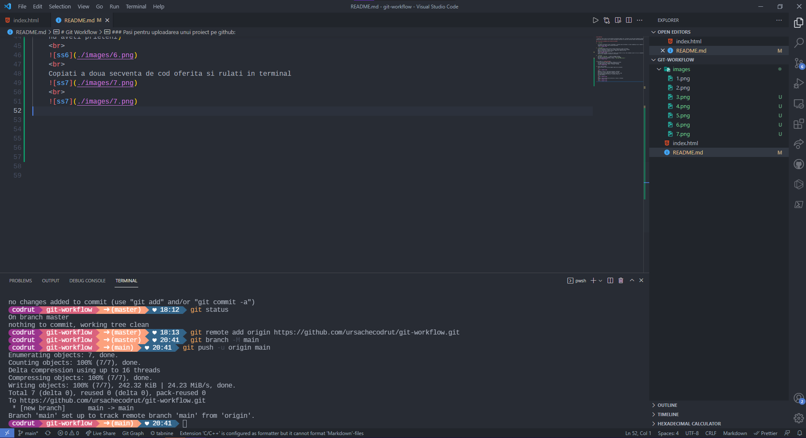
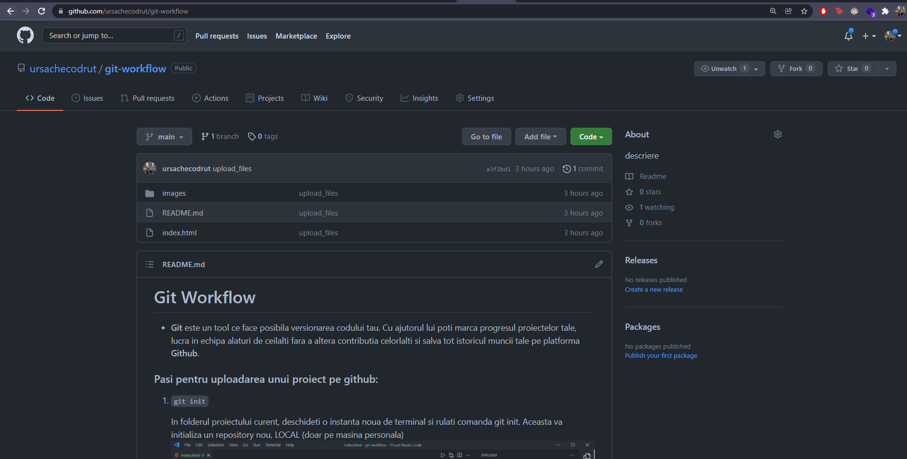

# Git Workflow

- <b>Git</b> este un tool ce face posibila versionarea codului tau. Cu ajutorul lui poti marca progresul proiectelor tale, lucra in echipa alaturi de ceilalti fara a altera contributia celorlalti si salva tot istoricul muncii tale pe platforma <b>Github</b>. 

###  Pasi pentru uploadarea unui proiect pe github:

1. ```git init```   

    In folderul proiectului curent, deschideti o instanta noua de terminal si rulati comanda git init. Aceasta va initializa un repository nou, LOCAL (doar pe masina personala)  
    <br>  
    

2. ```git status```    
    Cu aceasta comanda putem verifica statusul branch-ului curent. Un branch
    este ca 0 ramificatie a codului scris. Astfel fiecare persoana dintr-o echipa
    poate sa lucreze pe un branch personal, separat iar codul sa nu fie
    deteriorat. Mai multe detalii cand ne vedem live    
    <br>  
    
    Putem observa ca toate fisierele din folder sunt afisate cu rosu. Asta inseamna ca git nu le ia in considerare inca,
    adica nu sunt adaugate in procesul de versionare.

3. ```git add .```    
    Vom folosi ```git add . ``` pentru a adauga tracking 
    pe toate fisierele din folderul nostru. Pentru a adauga 
    doar anumite fisiere specifice, folosim ```git add <nume_fisier>```
    <br>
    


4. git commit -m "<commit_message>"      
    Acum ca am dat git add la fisiere, trebuie sa le atasam
    un commit alaturi de un mesaj sugestiv modificarii
    noi aduse proiectului. Flagul -m inseamna "message"
    

5. Create Repo on Github    
    Click pe butonul de new de pe pagina repo-urilor personale 
    <br> 

        
    <br> 
    Adaugati un nume si o descriere optionala. Selectati
    daca vreti sa fie un repo public (poate sa il vada
    oricine din aceasta galaxie), sau private (pot sa il vada
    doar persoanele la care oferiti o inviatie, pacat ca
    nu aveti prieteni :D) 

6. push repo on Github
    
    <br>
    Copiati a doua secventa de cod oferita si rulati in terminal
    
    <br>
    

8. done. your code is now on github
    


### Upload changes on github:

 Acum ca ati incarcat codul pe github nu este nevoie
sa faceti toti pasii anteriori pentru a incarca ultimele
modificari aduse proiectului pe github. Tot ce trebuie facut
este:

1. modifica codul tau
2. adauga toate modificarile ```git add .``` (sau ceva specific cu ```git add <file>```)
3. ```git commit -m "<commit_message>"``` (nu uita ca mesajul
de comit sa reflecte modificare aduse codului in cateva
cuvinte succinte - IN ENGLEZA SI VERBELE LA PREZENT)
4. ```git push``` va uploada codul automat pe branch-ul "main"
setat default (vom discuta pe viitor cum sa uploadati pe
un branch diferit)

### All done, please give feedback!