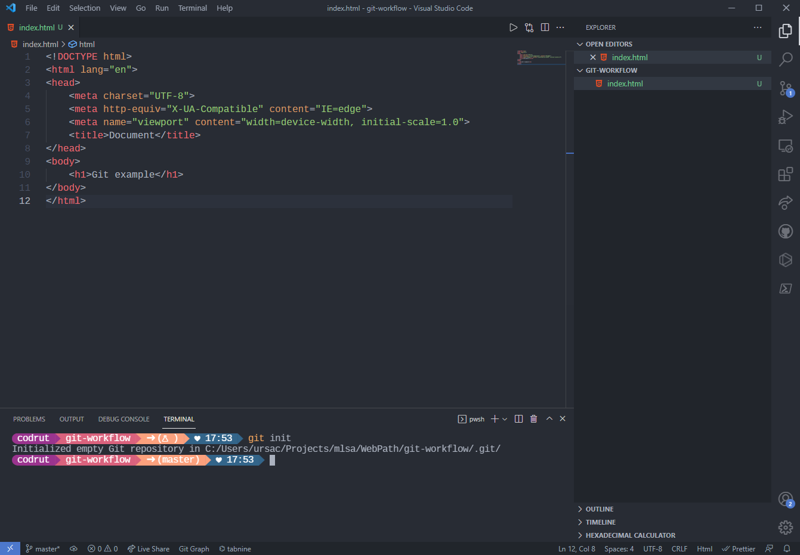
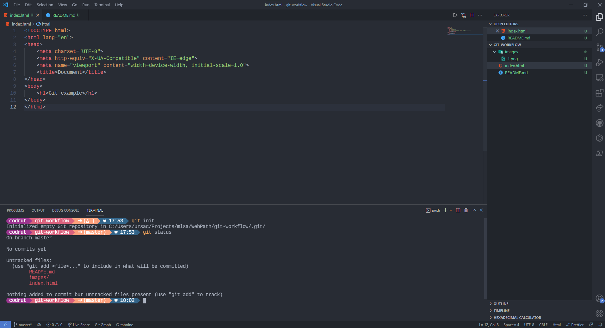

# Git Workflow

- <b>Git</b> este un tool ce face posibila versionarea codului tau. Cu ajutorul lui poti marca progresul proiectelor tale, lucra in echipa alaturi de ceilalti fara a altera contributia celorlalti si salva tot istoricul muncii tale pe platforma <b>Github</b>. 

###  Pasi pentru uploadarea unui proiect pe github:

1. ```git init```   

    In folderul proiectului curent, deschideti o instanta noua de terminal si rulati comanda git init. Aceasta va initializa un repository nou, LOCAL (doar pe masina personala)    
    

2. ```git status```    
    Cu aceasta comanda putem verifica statusul branch-ului curent. Un branch
    este ca ramificatie a codului scris. Astfel fiecare persoana dintr-o echipa
    poate sa lucreze pe un branch personal, separat iar codul sa nu fie
    deteriorat. Mai multe detalii live    
    
    Putem observa ca toate fisierele din folder sunt afisate cu rosu. Asta inseamna ca git nu le ia in considerare inca,
    adica nu sunt adaugate in procesul de versionare.

3. ```git add .```    
    Vom folosi ```git add . ``` pentru a adauga tracking 
    pe toate fisierele din folderul nostru. Pentru a adauga 
    doar anumite fisiere specifice, folosim ```git add <nume_fisier>```    
    
